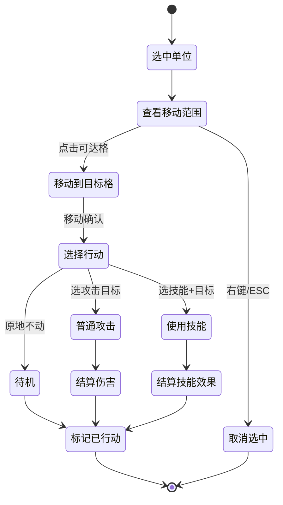

# BigWuXia — 游戏设计文档（SRPG 玩法）

本文档定义 BigWuXia 的**核心战斗玩法**，包括网格规则、回合流程、移动/攻击/技能机制、地形系统、属性克制、以及 3 个可玩角色的数值+技能表。

## 1. 网格战棋核心循环

### 1.1 游戏类型定位

BigWuXia 是一款 **2D 回合制网格战棋（SRPG）**，参考：
- **Fire Emblem**（移动+攻击单次行动、属性克制、地形修正）
- **Final Fantasy Tactics**（网格地图、技能范围 AOE、回合顺序）

核心循环：**选角色 → 查看移动范围 → 移动到目标格 → 选攻击/技能目标 → 结算伤害 → 下一单位 → 回合切换 → 胜负判定**。

### 1.2 网格尺寸

- **地图**: 12×10 方格（宽 12 格，高 10 格）
- **Tile 大小**: 64×64 像素（Tiny Swords Tilemap 原生尺寸）
- **屏幕分辨率**: 896×640（16:10，适配 1366×768 窗口）
- **坐标系**: 笛卡尔坐标（x 向右，y 向下），原点 (0, 0) 在左上角

**理由**：12×10 是战棋常见尺寸（足够放 3-5 个我方单位 + 5-8 个敌方单位 + 障碍物）；60fps 下 64px tile 滚动流畅；屏幕 896×640 刚好完整显示 14×10（留 2 格边距做 UI）。

## 2. 回合流程

### 2.1 阵营回合制

战斗分为**玩家阵营阶段**和**敌方阵营阶段**，轮流执行：

```
回合 1: 玩家阵营 → 敌方阵营
回合 2: 玩家阵营 → 敌方阵营
...
直到胜负判定触发
```

### 2.2 单元行动顺序

在同一阵营阶段内，单位按 **Speed（SPD）从高到低** 依次行动：
- 如果 SPD 相同，按场景树顺序（或 unit_id 升序）
- 每个单位行动完成后标记为"已行动"（半透明显示）
- 阵营阶段结束后，所有单位的"已行动"标记清除

### 2.3 单元行动流程

每个单位的一次行动包含以下步骤（玩家手动控制，敌方 AI 自动）：



**关键规则**：
- **移动 → 行动 → 结束**：单位只能移动一次，然后做一次行动（攻击/技能/待机），行动后立即结束该单位回合
- **移动可取消**：移动前可以右键取消选中；移动后进入"选择行动"状态后不能撤销移动（MVP 不做撤销）
- **攻击范围独立于移动范围**：近战武器攻击范围 1 格，弓箭 2-3 格，技能按 `skill.range` 自定义
- **已行动单位半透明**：视觉上清晰标记

### 2.4 回合切换

玩家阵营所有单位行动完毕后 → 敌方阵营开始行动 → 敌方所有单位行动完毕 → 新回合开始 → 玩家阵营。

UI 上显示"回合 N - 玩家阶段"或"回合 N - 敌方阶段"。

## 3. 移动系统

### 3.1 移动范围计算

每个单位有 **MOV（移动力）** 属性（例如徐凤年 MOV=4，姜泥 MOV=5）。

移动范围用 **Dijkstra/BFS with movement cost** 算法计算：
- 从单位当前位置出发
- 每移动到相邻格子，累积该格子的 **地形移动消耗**（见 §4.2）
- 如果累积消耗 ≤ MOV，该格子可达
- 被其他单位占据的格子**不可通行**（无论敌我），但可以"跨越"（消耗累加但不能停留）

**示例**：徐凤年 MOV=4，站在 (5,5)
- 平地 (6,5) 消耗 1 → 可达
- 林地 (7,5) 消耗 2 → 可达（累积 3）
- 林地 (8,5) 消耗 2 → 不可达（累积 5 > 4）

### 3.2 地形穿越规则

- **平地/草/路**：所有单位可穿越
- **林/山**：地面单位可穿越林（消耗 2），**不可穿越山**（障碍物）
- **水**：地面单位不可穿越，但**远程攻击可以跨越水**
- **单位占据格**：不可停留，但可以"绕过"（如果有足够 MOV 跨越多个占据格到达空格）

MVP 简化处理：单位占据格直接标记为"不可通行"，不做"绕过"逻辑（后续版本可优化）。

### 3.3 移动动画

- 移动时单位沿网格路径逐格移动（Tween 插值，每格 0.15s）
- 移动时播放 `Run` 动画（AnimatedSprite2D）
- 移动结束后播放 `Idle` 动画

## 4. 地形系统

### 4.1 地形类型

BigWuXia MVP 包含 6 种地形类型：

| 地形 | 移动消耗 | 闪避修正 | 防御修正 | 备注 |
|---|---|---|---|---|
| **平地**（Grass） | 1 | 0 | 0 | 默认地形 |
| **草丛**（Bush） | 1 | +10% | 0 | 增加闪避 |
| **林地**（Forest） | 2 | +20% | 0 | 高闪避但移动慢 |
| **山地**（Mountain） | ∞ | — | — | 不可通行（障碍物） |
| **水域**（Water） | ∞ | — | — | 不可通行，但远程攻击可跨越 |
| **路**（Road） | 0.5 | 0 | 0 | 快速移动，向下取整（MOV=4 走 8 格路） |

**实现方式**：TileMapLayer 渲染视觉地形，GridSystem 脚本保存 `Dictionary[Vector2i → TileData]`，TileData 是 Resource 类包含 `movement_cost / dodge_bonus / def_bonus / is_obstacle`。

### 4.2 地形修正（战斗结算时）

- **闪避修正**：攻击命中率 = 基础命中率（95%）− 目标地形闪避加成
  - 例如站在林地的单位，闪避率 +20%，攻击者命中率降为 75%
- **防御修正**（MVP 暂不实现）：后续版本可加"山地 +5 DEF"这类修正

## 5. 攻击系统

### 5.1 攻击范围

每个单位有 **武器攻击范围**（由 UnitData.weapon_range 定义）：

| 武器类型 | 范围 | 示例角色 |
|---|---|---|
| 近战（刀/剑） | 1 格（相邻） | 徐凤年、李淳罡 |
| 弓箭 | 2-3 格（环形） | 敌方弓箭手（Archer sprite） |
| 技能 | 自定义（见 §6） | 例如"剑气"直线 3 格 |

**攻击范围判定**：
- **近战 1 格**：Chebyshev 距离 = 1（上下左右 + 四角共 8 格）
- **弓箭 2-3 格**：Chebyshev 距离 ∈ [2, 3]（环形区域）
- **技能**：按 SkillData.range_type（单格/直线/十字/环形/AOE）计算

### 5.2 伤害公式

基础伤害公式：

```
实际伤害 = max(1, 攻击方 ATK × 技能倍率 − 防御方 DEF)
```

**命中判定**：
- 基础命中率 = 95%
- 实际命中率 = 95% − 目标地形闪避修正
- 随机数 < 实际命中率 → 命中，否则 MISS

**暴击判定**（MVP 简化）：
- 固定 10% 暴击率（无法堆叠）
- 暴击伤害 = 实际伤害 × 1.5

**伤害结算流程**：
1. 判定命中（95% − 地形闪避）
2. 如未命中，显示"MISS"浮字，结束
3. 如命中，判定暴击（10%）
4. 计算伤害 = max(1, ATK×k − DEF)
5. 如暴击，伤害 ×1.5
6. 目标 HP -= 伤害
7. 显示伤害浮字（暴击用橙色）
8. 如目标 HP ≤ 0，播放死亡动画并移除单位

### 5.3 反击系统（MVP 暂不实现）

MVP 阶段**不做反击**（简化战斗逻辑）。后续版本可加：如果被攻击单位在攻击范围内且未行动，可以反击一次。

## 6. 技能系统

### 6.1 技能机制

每个单位有 2-3 个技能（见 §7 角色数值表）：
- **普攻（默认）**：无 CD，攻击范围 = 武器范围
- **主动技能 1-2**：有冷却时间（CD），范围/效果自定义

**技能结构**（SkillData Resource）：
```gdscript
class_name SkillData extends Resource

@export var skill_name: String              # 技能名称
@export var description: String             # 描述
@export var cooldown: int                   # 冷却回合数（0 = 无 CD）
@export var range_type: RangeType          # 单格/直线/十字/AOE
@export var range_value: int                # 范围数值（例如直线 3 格）
@export var damage_multiplier: float        # 伤害倍率（1.0 = 等同 ATK）
@export var effect_type: EffectType        # 伤害/治疗/buff/debuff
@export var effect_value: int               # 效果数值（例如治疗 8 HP）
@export var animation_key: String           # 动画 key（例如"Heal"）
```

### 6.2 冷却（CD）机制

- 技能使用后，`current_cd = cooldown`（例如"两袖青蛇"CD=2，使用后 current_cd=2）
- 每回合开始时，所有单位的 `current_cd -= 1`（最低 0）
- `current_cd > 0` 时技能不可用（UI 灰化显示）

### 6.3 范围类型

| RangeType | 说明 | 示例 |
|---|---|---|
| SINGLE | 单个目标格（距离 ≤ range_value） | 治疗术（单体） |
| LINE | 直线穿透（从施法者到目标方向，长度 range_value） | 剑气（直线 3 格） |
| CROSS | 十字形（以目标格为中心，半径 range_value） | 两袖青蛇（十字 2 格） |
| AOE | 圆形范围（Chebyshev 距离 ≤ range_value） | 剑开天门（5 格圆形） |

**实现要点**：
- LINE 类型需要计算方向向量（从施法者到目标格）
- CROSS/AOE 需要遍历范围内所有格子判定敌我

## 7. 属性与克制

### 7.1 基础属性

每个单位有 5 个基础属性：

| 属性 | 缩写 | 说明 | 典型范围 |
|---|---|---|---|
| 生命值 | HP | 当前 / 最大生命值 | 15-35 |
| 攻击力 | ATK | 物理伤害基数 | 3-15 |
| 防御力 | DEF | 减伤值 | 2-8 |
| 速度 | SPD | 决定行动顺序（越高越先动） | 4-10 |
| 移动力 | MOV | 每回合可移动格数 | 3-6 |

**成长/升级**：MVP 阶段角色数值固定，不做升级。

### 7.2 武器克制（石头剪刀布）

BigWuXia 的武器克制关系：

```
刀 > 剑 > 内功 > 刀
```

- **刀克剑**（徐凤年的刀 vs 李淳罡的剑）：刀攻击剑时，伤害 ×1.25
- **剑克内功**（李淳罡的剑 vs 姜泥的内功）：剑攻击内功时，伤害 ×1.25
- **内功克刀**（姜泥的内功 vs 徐凤年的刀）：内功攻击刀时，伤害 ×1.25

**实现方式**：UnitData 有 `weapon_type: WeaponType`（enum: BLADE/SWORD/INNER），伤害公式中加克制判定：
```gdscript
var multiplier = 1.0
if attacker.weapon_type 克制 defender.weapon_type:
    multiplier = 1.25
实际伤害 = max(1, ATK × multiplier × skill_multiplier − DEF)
```

**注意**：MVP 阶段敌方单位（普通兵）不区分武器类型，后续版本可扩展。

## 8. 3 角色数值表

### 8.1 徐凤年（主 T / 均衡型）

**背景**：北凉世子，春秋刀法传人，均衡型前排坦克。

| 属性 | 数值 | 说明 |
|---|---|---|
| HP | 28 | 最肉 |
| ATK | 8 | 中等输出 |
| DEF | 5 | 高防 |
| SPD | 6 | 中速 |
| MOV | 4 | 标准移动 |
| 武器类型 | BLADE（刀） | 克制剑 |
| 武器范围 | 1（近战） | 相邻攻击 |

**Sprite 映射**：`Units/Blue Units/Warrior/`（蓝色战士，刀客形象）

**技能列表**：

| # | 技能名 | CD | 范围 | 效果 | 描述 |
|---|---|---|---|---|---|
| 0 | 春秋刀法（普攻） | 0 | 1 格近战 | 伤害 = ATK×1.0，暴击率 10% | 基础攻击 |
| 1 | 两袖青蛇 | 2 | 十字 2 格 | 伤害 = ATK×0.8，AOE 小范围 | 以目标为中心十字形攻击（上下左右各 2 格） |

**动画映射**：
- Idle: `Warrior_Idle.png`（8 帧）
- Run: `Warrior_Run.png`（6 帧）
- Attack: `Warrior_Attack1.png`（4 帧）
- Skill（两袖青蛇）: `Warrior_Attack2.png`（4 帧） + Particle FX

### 8.2 姜泥（辅助 / 治疗型）

**背景**：北凉王妃，轻功卓绝，医术精湛，辅助/治疗位。

| 属性 | 数值 | 说明 |
|---|---|---|
| HP | 18 | 脆皮 |
| ATK | 3 | 低输出 |
| DEF | 3 | 低防 |
| SPD | 8 | 最快（优先行动） |
| MOV | 5 | 高移动（轻功） |
| 武器类型 | INNER（内功） | 克制刀 |
| 武器范围 | 1（近战，但主打技能） | — |

**Sprite 映射**：`Units/Blue Units/Monk/`（蓝色僧侣，改为女性轻功形象）

**技能列表**：

| # | 技能名 | CD | 范围 | 效果 | 描述 |
|---|---|---|---|---|---|
| 0 | 内功掌（普攻） | 0 | 1 格近战 | 伤害 = ATK×1.0 | 低伤害普攻 |
| 1 | 回春术 | 1 | 单格 3 格内 | 治疗目标 8 HP | 单体治疗，CD 短 |
| 2 | 轻功·掠影 | 3 | 自身 | 立即再移动一次（MOV+3，可跨越障碍） | 相当于"二段跳"，用于脱离包围或快速支援 |

**动画映射**：
- Idle: `Monk/Idle.png`（6 帧）
- Run: `Monk/Run.png`（4 帧）
- Heal: `Monk/Heal.png` + `Heal_Effect.png`（11 帧）
- Skill（轻功）: `Run.png` 快速播放 + 残影特效

### 8.3 李淳罡（爆发 / 大招型）

**背景**：剑神，一剑开天门，高攻低防爆发型。

| 属性 | 数值 | 说明 |
|---|---|---|
| HP | 22 | 中血量 |
| ATK | 12 | 最高攻击 |
| DEF | 4 | 低防 |
| SPD | 5 | 偏慢 |
| MOV | 3 | 移动慢（老年剑客） |
| 武器类型 | SWORD（剑） | 克制内功 |
| 武器范围 | 1（近战） | — |

**Sprite 映射**：`Units/Purple Units/Warrior/`（紫色战士，剑客形象）

**技能列表**：

| # | 技能名 | CD | 范围 | 效果 | 描述 |
|---|---|---|---|---|---|
| 0 | 剑气（普攻+） | 0 | 直线 2 格 | 伤害 = ATK×1.1，穿透第一个单位 | 比普攻略强 |
| 1 | 剑气·如雷 | 2 | 直线 3 格 | 伤害 = ATK×1.5，穿透所有单位 | 直线 AOE |
| 2 | 剑开天门（大招） | ∞（整局 1 次） | 十字 5 格 AOE | 伤害 = ATK×4.5，巨大十字范围 | 终极技能，每局只能用 1 次 |

**动画映射**：
- Idle: `Warrior_Idle.png`（8 帧）
- Run: `Warrior_Run.png`（6 帧）
- Attack: `Warrior_Attack1.png`（4 帧）
- Skill（剑气）: `Warrior_Attack2.png`（4 帧） + 剑气粒子
- Ultimate（剑开天门）: `Warrior_Attack2.png` 慢放 + 大范围剑气爆炸特效

## 9. 胜负判定

### 9.1 胜利条件

BigWuXia MVP 的 2 个关卡有不同胜利条件：

| 关卡 | 胜利条件 |
|---|---|
| 教程关 | 击败所有敌方单位（3-4 只普通兵） |
| 正式关 | 击败 BOSS（+ 可选：击败所有敌人） |

**实现**：BattleController 每回合结束检查：
```gdscript
if all_enemies_defeated() or boss_defeated():
    trigger_victory()
```

### 9.2 失败条件

任一条件触发即失败：
- 所有玩家单位阵亡（HP ≤ 0）
- 特定单位阵亡（例如教程关如果徐凤年死亡，直接 Game Over）

**实现**：每次单位死亡时检查：
```gdscript
if player_units.filter(func(u): return u.hp > 0).size() == 0:
    trigger_defeat()
```

### 9.3 结算界面

胜利/失败后显示结算界面：
- **Victory**：显示"关卡完成" + 回到主菜单按钮
- **Defeat**：显示"失败" + 重试按钮 + 回主菜单按钮

MVP 不做"战斗结算奖励/经验值"（因为无成长系统）。

## 10. AI 行为（敌方单位）

### 10.1 简单 AI 策略

MVP 阶段敌方单位使用**简单贪心 AI**：

1. 找到距离最近的玩家单位（BFS 距离）
2. 如果在攻击范围内，攻击它
3. 如果不在攻击范围内，向它移动（BFS 找最短路径）
4. 如果移动后仍不在攻击范围，待机

**伪代码**：
```gdscript
func enemy_ai(unit: Unit):
    var target = find_nearest_player_unit(unit)
    if is_in_attack_range(unit, target):
        attack(target)
    else:
        var path = find_path_to(unit, target)
        if path.size() > 0:
            move_along_path(unit, path, unit.get_current_mov())
        if is_in_attack_range(unit, target):  # 移动后再判断
            attack(target)
        else:
            wait()
```

### 10.2 后续优化方向

后续版本可优化 AI：
- 优先攻击血量最低的单位
- 避免进入高闪避地形
- BOSS 有特殊技能释放策略

MVP 阶段不做复杂 AI。

## 11. 教程关 + 正式关大纲

详见 [05-mvp-scope.md](./05-mvp-scope.md) §3 关卡设计。此处仅列大纲：

### 11.1 教程关（Tutorial）

- **地图**: 8×8 小地图，少量障碍物（山/林）
- **我方单位**: 徐凤年 + 姜泥（2 人）
- **敌方单位**: 3 只普通兵（Red Warrior，低血量低攻击）
- **教学目标**:
  1. 移动（鼠标点击移动范围内的格子）
  2. 普攻（点击敌方单位）
  3. 技能（点击技能按钮 → 选目标）
  4. 地形（站在林地可以增加闪避）
  5. 回合切换
- **胜利条件**: 击败 3 只敌人
- **预计时长**: 3-5 回合

### 11.2 正式关（Level 1）

- **关卡名**: 北凉王府之战
- **地图**: 12×10 完整地图，复杂地形（山/水/林/路混合）
- **我方单位**: 徐凤年 + 姜泥 + 李淳罡（3 人）
- **敌方单位**:
  - 5 只普通兵（Red Warrior / Archer 混编）
  - 1 只 BOSS：**杨元赞**（北莽大将军，使大刀，Red Warrior 改色 + 重武器姿态）
- **胜利条件**: 击败 BOSS（杨元赞）
- **预计时长**: 8-12 回合

#### 11.2.1 BOSS 设定：杨元赞

**人设**（IP 落地）：
- **身份**: 北莽南朝大将军，镇守虎头城一线，与北凉三十万铁骑多次交锋
- **形象**: 中年武将，身披重甲，使一柄百炼精钢大刀（非轻兵器），以**力破巧**著称
- **性格**: 沉稳持重，不逞个人之勇，讲究战阵章法
- **与徐凤年关系**: 北凉宿敌，本关是徐凤年接手北凉王位后的第一场硬仗

**Sprite 选型**：
- **基底**: `Units/Red Units/Warrior/`（Red Warrior 整套动画）
- **着色调整**（S6 polish 阶段）:
  - modulate 颜色：Red → 深红/暗金（模拟北莽重甲反光）
  - 可选：叠加 tint shader 加深铠甲金属感
- **姿态选择**: 优先播放 `Warrior_Attack2.png`（重武器大挥动作，比 Attack1 更具压迫感）作为 skill 动画；`Warrior_Guard.png` 作为受击/防御动作
- **尺寸**: 192×192 同普通兵，但 Unit 节点 scale = 1.15（视觉上略大于普通兵，强化 BOSS 存在感）

**数值**（对应 §9.1 胜利条件）：

| 属性 | 数值 | 说明 |
|---|---|---|
| HP | 35 | 最高血量（远超玩家单角色上限 28） |
| ATK | 10 | 高攻（克制姜泥时 1 击可打 5-7 血） |
| DEF | 6 | 最高防御（徐凤年普攻净伤约 2-3） |
| SPD | 6 | 与徐凤年同速 |
| MOV | 4 | 标准移动 |
| 武器类型 | BLADE（刀） | 克制李淳罡（剑），被姜泥（内功）克制 |
| 武器范围 | 1（近战） | — |

**技能清单**：

| # | 技能名 | CD | 范围 | 效果 | 描述 |
|---|---|---|---|---|---|
| 0 | 大刀斩（普攻） | 0 | 1 格近战 | 伤害 = ATK×1.0 | 基础重刀斩击 |
| 1 | **横扫千军** | 2 | 十字 2 格 AOE（以 BOSS 为中心） | 伤害 = ATK×1.1 | 以自身为中心挥刀一扫，上下左右各 2 格内所有单位受创；**玩家需避免 2 人挤在 BOSS 相邻格** |

**AI 行为**（BOSS 特殊策略，覆盖 §10.1 简单贪心）：
- 当攻击范围内有 ≥ 2 个玩家单位（挤在相邻格）时，优先使用「横扫千军」
- 当「横扫千军」CD 中时，退化为简单贪心（攻击最近玩家单位）
- 不主动追击（MOV=4 但只在被攻击后才移动），制造"守门 BOSS"体验

**玩法意图**：
- 考验玩家**走位**（别挤在一起吃 AOE）
- 考验玩家**资源管理**（李淳罡的"剑开天门"整局 1 次，留给 BOSS 才是最优解）
- 考验玩家**治疗时机**（姜泥"回春术"CD=1，要在徐凤年被集火时精准治疗）

## 12. 参考资料

- **Fire Emblem 战斗系统**: https://fireemblemwiki.org/wiki/Battle
- **Final Fantasy Tactics 玩法**: https://finalfantasy.fandom.com/wiki/Final_Fantasy_Tactics
- **SRPG 设计要点**: https://www.gamedeveloper.com/design/the-core-mechanics-of-strategy-rpgs

---

**下一步**：阅读 [02-architecture.md](./02-architecture.md) 了解 Godot 项目结构和数据模型。
