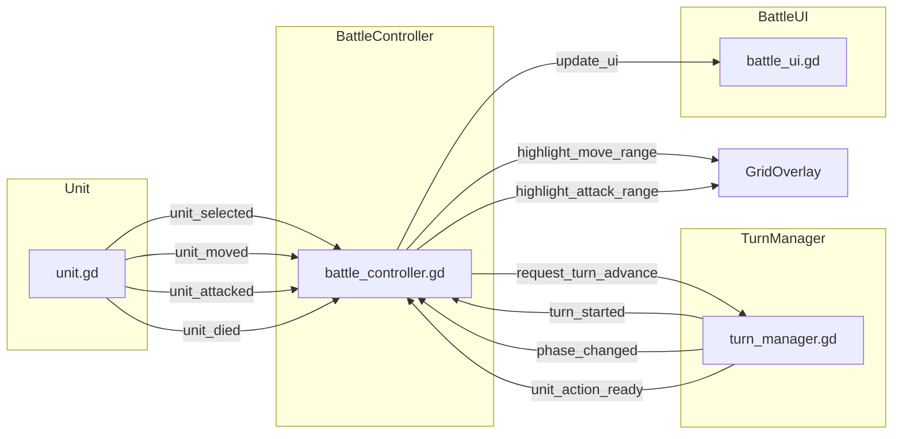
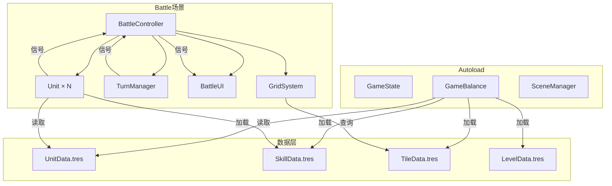

# BigWuXia — 架构设计文档

本文档定义 BigWuXia 的 Godot 项目结构、场景树、autoload、数据模型（Resource 类）、信号拓扑，以及代码组织规范。

## 1. Godot 项目结构

### 1.1 目录结构

```
big-wuxia/
├─ project.godot             # Godot 项目配置（config_version=5）
├─ .gitignore                # 忽略 .godot/ .import/ *.translation
├─ docs/                     # 设计文档（本系列）
│  └─ design/
│     ├─ 00-overview.md
│     ├─ 01-game-design.md
│     ├─ 02-architecture.md  # 本文
│     └─ ...
├─ scenes/                   # 场景 + 同目录脚本
│  ├─ main_menu/
│  │  ├─ main_menu.tscn
│  │  └─ main_menu.gd
│  ├─ character_select/
│  │  ├─ character_select.tscn
│  │  └─ character_select.gd
│  ├─ battle/
│  │  ├─ battle.tscn          # 战斗主场景
│  │  ├─ battle_controller.gd # 战斗逻辑控制器
│  │  ├─ grid_system.gd       # 网格逻辑系统
│  │  ├─ turn_manager.gd      # 回合管理
│  │  └─ battle_ui.gd         # 战斗 UI
│  ├─ unit/
│  │  ├─ unit.tscn            # 通用单位场景（Player/Enemy 共用）
│  │  └─ unit.gd              # 单位逻辑（移动/攻击/技能）
│  ├─ victory/
│  │  ├─ victory.tscn
│  │  └─ victory.gd
│  └─ defeat/
│     ├─ defeat.tscn
│     └─ defeat.gd
├─ scripts/                  # 独立逻辑系统（不绑场景）
│  ├─ core/
│  │  ├─ constants.gd         # 全局常量（enum WeaponType / RangeType）
│  │  └─ utils.gd             # 工具函数（distance、path_find）
│  ├─ systems/
│  │  ├─ damage_calculator.gd # 伤害/命中/暴击计算
│  │  ├─ skill_executor.gd    # 技能执行器
│  │  └─ ai_controller.gd     # 敌方 AI
│  └─ components/
│     ├─ health_bar.gd        # 血条组件（3D 空间血条）
│     └─ damage_label.gd      # 伤害浮字
├─ resources/                # 配置、数据、素材
│  ├─ data/
│  │  ├─ units/
│  │  │  ├─ xu_fengnian_data.tres   # 徐凤年数值
│  │  │  ├─ jiang_ni_data.tres      # 姜泥数值
│  │  │  ├─ li_chungang_data.tres   # 李淳罡数值
│  │  │  └─ enemy_soldier_data.tres # 敌方普通兵
│  │  ├─ skills/
│  │  │  ├─ chun_qiu_dao_fa.tres    # 春秋刀法
│  │  │  ├─ liang_xiu_qing_she.tres # 两袖青蛇
│  │  │  ├─ hui_chun_shu.tres       # 回春术
│  │  │  ├─ qing_gong.tres          # 轻功·掠影
│  │  │  ├─ jian_qi.tres            # 剑气
│  │  │  └─ jian_kai_tian_men.tres  # 剑开天门
│  │  ├─ tiles/
│  │  │  ├─ grass_tile.tres
│  │  │  ├─ forest_tile.tres
│  │  │  ├─ mountain_tile.tres
│  │  │  └─ ...
│  │  └─ levels/
│  │     ├─ tutorial_level.tres      # 教程关配置
│  │     └─ level_1.tres             # 正式关配置
│  ├─ sprites/               # 从 Tiny Swords 拷贝的 sprite（import 后）
│  │  ├─ units/
│  │  │  ├─ blue_warrior/
│  │  │  ├─ purple_warrior/
│  │  │  ├─ blue_monk/
│  │  │  ├─ red_warrior/
│  │  │  └─ ...
│  │  ├─ terrain/
│  │  │  └─ tilemap_color1.png
│  │  └─ ui/
│  │     ├─ buttons/
│  │     ├─ bars/
│  │     └─ papers/
│  ├─ fonts/                 # 武侠字体
│  │  ├─ noto_serif_cjk.ttf  # 思源宋体（免费商用）
│  │  └─ ...
│  ├─ audio/                 # 音效/音乐（MVP 后期加）
│  │  ├─ sfx/
│  │  └─ bgm/
│  └─ vfx/                   # 粒子特效预设（剑气/刀光）
│     ├─ sword_aura.tscn
│     └─ blade_flash.tscn
├─ autoload/                 # 全局单例（Autoload）
│  ├─ game_state.gd          # 游戏状态管理（当前关卡/角色选择）
│  ├─ game_balance.gd        # 数值表读取/查询
│  ├─ scene_manager.gd       # 场景切换管理
│  └─ audio_bus.gd           # 音频管理（MVP 后期）
├─ tests/                    # GUT 单元测试
│  ├─ test_grid_system.gd
│  ├─ test_damage_calculator.gd
│  └─ test_skill_executor.gd
└─ tools/                    # 开发工具
   ├─ screenshot_harness.gd  # 截图 harness（验收用）
   └─ debug_overlay.gd       # Debug 覆盖层（显示网格坐标/移动范围）
```

### 1.2 命名规范

| 类型 | 命名规则 | 示例 |
|---|---|---|
| 场景文件 | snake_case.tscn | `main_menu.tscn`, `battle.tscn` |
| 脚本文件 | snake_case.gd（与场景同名或语义明确） | `battle_controller.gd`, `unit.gd` |
| Resource 文件 | snake_case_data.tres | `xu_fengnian_data.tres`, `grass_tile.tres` |
| 类名（class_name） | PascalCase | `BattleController`, `UnitData` |
| 函数/变量 | snake_case | `calculate_damage()`, `current_hp` |
| 常量/枚举 | UPPER_SNAKE_CASE | `MAX_HP`, `WeaponType.BLADE` |
| 信号 | snake_case（过去式或被动语态） | `unit_died`, `turn_started`, `damage_dealt` |

### 1.3 Git 规范

- **分支策略**: main（稳定）+ sprint-N（开发）
- **commit 格式**: 中文，遵循 `feat: / fix: / docs: / test:` 前缀
  - 示例: `feat: 完成 S1 项目骨架 + 主菜单`
- **.gitignore**:
  ```
  .godot/
  .import/
  *.translation
  export_presets.cfg
  .DS_Store
  ```

## 2. 场景树结构

### 2.1 MainMenu 场景

```
MainMenu (Control)
├─ BackgroundLayer (TextureRect)            # 山水背景
├─ TitleLabel (Label)                       # "雪中悍刀行"
├─ VBoxContainer
│  ├─ StartButton (Button)                  # "开始游戏" → CharacterSelect
│  ├─ TutorialButton (Button)               # "教程" → Battle(Tutorial)
│  └─ QuitButton (Button)                   # "退出"
└─ AudioStreamPlayer (背景音乐，MVP 后期)
```

**脚本**: `main_menu.gd`
- 信号: `start_pressed`, `tutorial_pressed`, `quit_pressed`
- 功能: 按钮点击 → 调用 `SceneManager.change_scene_to_file(path)`

### 2.2 CharacterSelect 场景（MVP 简化，固定 3 角色）

```
CharacterSelect (Control)
├─ BackgroundLayer (TextureRect)
├─ TitleLabel (Label)                       # "选择出战角色"
├─ CharacterGrid (GridContainer)
│  ├─ XuFengnianCard (Panel)                # 徐凤年卡片（头像+名字+属性预览）
│  ├─ JiangNiCard (Panel)                   # 姜泥卡片
│  └─ LiChungangCard (Panel)                # 李淳罡卡片
├─ ConfirmButton (Button)                   # "确认出战" → Battle(Level1)
└─ BackButton (Button)                      # "返回" → MainMenu
```

**脚本**: `character_select.gd`
- MVP 阶段：3 个角色**全选**（无选择逻辑），点确认直接进 Battle
- 后续版本：可选 3 选 2 或 5 选 3

### 2.3 Battle 场景（核心）

```
Battle (Node2D)
├─ TileMapLayer (地形渲染，Godot 4.6 新 API)
│  ├─ 源图: resources/sprites/terrain/tilemap_color1.png
│  └─ TileSet: 自动 import（64×64 autotile）
├─ GridOverlay (TileMapLayer)               # 高亮层（移动范围/攻击范围绿/红色块）
├─ UnitsContainer (Node2D)                  # 所有单位的父节点
│  ├─ XuFengnian (Unit)
│  ├─ JiangNi (Unit)
│  ├─ LiChungang (Unit)
│  ├─ EnemySoldier1 (Unit)
│  └─ ...
├─ BattleController (Node)                  # 核心逻辑控制器（无场景树，纯脚本节点）
│  ├─ @onready var grid_system: GridSystem
│  ├─ @onready var turn_manager: TurnManager
│  └─ @onready var ui: BattleUI
├─ GridSystem (Node)                        # 网格逻辑系统（Dictionary 存储格子数据）
├─ TurnManager (Node)                       # 回合管理（Phase FSM + 单位队列）
├─ CanvasLayer (UI)
│  └─ BattleUI (Control)
│     ├─ TopBar (HBoxContainer)
│     │  ├─ TurnLabel (Label)               # "回合 3 - 玩家阶段"
│     │  └─ PhaseLabel (Label)              # "移动中"
│     ├─ UnitInfoPanel (Panel)              # 左侧单位信息（选中时显示）
│     │  ├─ PortraitRect (TextureRect)      # 头像
│     │  ├─ NameLabel (Label)
│     │  ├─ HPBar (ProgressBar)
│     │  └─ StatsGrid (GridContainer)       # ATK/DEF/SPD/MOV
│     ├─ ActionPanel (Panel)                # 右下角行动菜单（移动后出现）
│     │  ├─ AttackButton (Button)
│     │  ├─ Skill1Button (Button)
│     │  ├─ Skill2Button (Button)
│     │  └─ WaitButton (Button)
│     └─ MessageLabel (Label)               # 顶部消息提示（"敌方回合"/"Victory!"）
└─ Camera2D                                 # 镜头（可拖拽/缩放，MVP 固定视角）
```

**脚本**:
- `battle_controller.gd`: 核心控制器，协调 GridSystem / TurnManager / UI
- `grid_system.gd`: 网格逻辑（移动范围/攻击范围计算、occupancy 管理）
- `turn_manager.gd`: 回合状态机（Phase FSM）+ 单位行动队列
- `battle_ui.gd`: UI 更新（血条/按钮/消息）

### 2.4 Unit 场景（通用单位）

```
Unit (Node2D)
├─ AnimatedSprite2D                         # 角色动画（Idle/Run/Attack）
│  ├─ SpriteFrames: 包含 5 个动画
│  │  ├─ "idle"
│  │  ├─ "run"
│  │  ├─ "attack"
│  │  ├─ "skill"
│  │  └─ "death"
│  └─ offset: Vector2(0, -32)               # sprite 底部对齐 tile 中心
├─ HealthBar (Control)                      # 血条（3D 空间，始终朝上）
│  ├─ Background (ColorRect)
│  ├─ Fill (ProgressBar)
│  └─ HPLabel (Label)
├─ SelectIndicator (Sprite2D)               # 选中指示器（圆圈光环）
├─ ActedIndicator (Sprite2D)                # 已行动指示器（半透明遮罩）
└─ CollisionShape2D (用于鼠标点击检测)      # Area2D / StaticBody2D
```

**脚本**: `unit.gd`
- **属性**: `unit_data: UnitData`（Resource）, `current_hp: int`, `current_position: Vector2i`, `skills: Array[SkillData]`, `acted: bool`
- **方法**:
  - `move_to(target: Vector2i) -> void`: 移动到目标格（Tween 插值）
  - `attack(target: Unit) -> void`: 普攻目标
  - `use_skill(skill_idx: int, target: Vector2i) -> void`: 使用技能
  - `take_damage(amount: int) -> void`: 受到伤害
  - `die() -> void`: 死亡动画 + 移除
- **信号**:
  - `signal unit_selected(unit: Unit)`
  - `signal unit_moved(from: Vector2i, to: Vector2i)`
  - `signal unit_attacked(attacker: Unit, defender: Unit)`
  - `signal unit_died(unit: Unit)`

### 2.5 Victory / Defeat 场景

```
Victory (Control)
├─ BackgroundLayer (ColorRect, 半透明黑)
├─ CenterContainer
│  └─ VBoxContainer
│     ├─ TitleLabel (Label)                 # "胜利！"
│     ├─ MessageLabel (Label)               # "已击败所有敌人"
│     ├─ ReturnButton (Button)              # "返回主菜单"
│     └─ (NextButton - MVP 无下一关)
```

类似地，Defeat 场景多一个 `RetryButton`。

## 3. Autoload（全局单例）

Godot 的 Autoload 系统在 `project.godot` 中配置，以下 4 个单例在项目启动时自动加载：

### 3.1 GameState

**路径**: `autoload/game_state.gd`

**职责**: 管理游戏全局状态（当前关卡、角色选择、进度保存）。

```gdscript
extends Node
class_name GameState

var current_level: String = ""              # "tutorial" / "level_1"
var selected_characters: Array[String] = [] # MVP 固定 ["xu_fengnian", "jiang_ni", "li_chungang"]
var completed_levels: Array[String] = []    # 已通关的关卡

signal level_completed(level_name: String)

func start_level(level_name: String) -> void:
    current_level = level_name
    # 后续可加载关卡配置

func complete_level(level_name: String) -> void:
    if level_name not in completed_levels:
        completed_levels.append(level_name)
    level_completed.emit(level_name)

func reset() -> void:
    current_level = ""
    selected_characters = []
    completed_levels = []
```

### 3.2 GameBalance

**路径**: `autoload/game_balance.gd`

**职责**: 加载并缓存所有 `UnitData` / `SkillData` / `TileData` / `LevelData` Resource，提供统一查询接口。

```gdscript
extends Node
class_name GameBalance

var units: Dictionary = {}        # key: String (unit_id), value: UnitData
var skills: Dictionary = {}       # key: String (skill_id), value: SkillData
var tiles: Dictionary = {}        # key: String (tile_id), value: TileData
var levels: Dictionary = {}       # key: String (level_id), value: LevelData

func _ready() -> void:
    _load_all_resources()

func _load_all_resources() -> void:
    # 硬编码路径（MVP），后续可改用 ResourceLoader.list_directory
    units["xu_fengnian"] = load("res://resources/data/units/xu_fengnian_data.tres")
    units["jiang_ni"] = load("res://resources/data/units/jiang_ni_data.tres")
    units["li_chungang"] = load("res://resources/data/units/li_chungang_data.tres")
    units["enemy_soldier"] = load("res://resources/data/units/enemy_soldier_data.tres")
    
    skills["chun_qiu_dao_fa"] = load("res://resources/data/skills/chun_qiu_dao_fa.tres")
    # ... 其他技能
    
    tiles["grass"] = load("res://resources/data/tiles/grass_tile.tres")
    tiles["forest"] = load("res://resources/data/tiles/forest_tile.tres")
    # ... 其他 tile
    
    levels["tutorial"] = load("res://resources/data/levels/tutorial_level.tres")
    levels["level_1"] = load("res://resources/data/levels/level_1.tres")

func get_unit_data(unit_id: String) -> UnitData:
    return units.get(unit_id)

func get_skill_data(skill_id: String) -> SkillData:
    return skills.get(skill_id)

func get_tile_data(tile_id: String) -> TileData:
    return tiles.get(tile_id)

func get_level_data(level_id: String) -> LevelData:
    return levels.get(level_id)
```

### 3.3 SceneManager

**路径**: `autoload/scene_manager.gd`

**职责**: 统一管理场景切换（带淡入淡出动画）。

```gdscript
extends Node
class_name SceneManager

var _loading := false

func change_scene_to_file(path: String) -> void:
    if _loading:
        return
    _loading = true
    
    # Fade out
    var tween := create_tween()
    var fade_layer := CanvasLayer.new()
    var fade_rect := ColorRect.new()
    fade_rect.color = Color.BLACK
    fade_rect.modulate.a = 0.0
    fade_rect.set_anchors_preset(Control.PRESET_FULL_RECT)
    fade_layer.add_child(fade_rect)
    get_tree().root.add_child(fade_layer)
    
    tween.tween_property(fade_rect, "modulate:a", 1.0, 0.3)
    await tween.finished
    
    # Change scene
    get_tree().change_scene_to_file(path)
    await get_tree().process_frame
    
    # Fade in
    tween = create_tween()
    tween.tween_property(fade_rect, "modulate:a", 0.0, 0.3)
    await tween.finished
    
    fade_layer.queue_free()
    _loading = false

func reload_current_scene() -> void:
    change_scene_to_file(get_tree().current_scene.scene_file_path)
```

### 3.4 AudioBus（MVP 后期）

**路径**: `autoload/audio_bus.gd`

**职责**: 音效/音乐播放管理（MVP 后期补充，S6 polish 阶段）。

```gdscript
extends Node
class_name AudioBus

func play_sfx(sfx_name: String) -> void:
    # 播放音效
    pass

func play_bgm(bgm_name: String) -> void:
    # 播放背景音乐
    pass

func stop_bgm() -> void:
    pass
```

## 4. 数据模型（Resource 类）

所有数值配置用 Godot Resource 存储（`.tres` 文件），便于可视化编辑和版本控制。

### 4.1 UnitData（单位数值）

**路径**: `scripts/core/unit_data.gd`

```gdscript
class_name UnitData extends Resource

@export var unit_id: String                # 唯一 ID（例如"xu_fengnian"）
@export var unit_name: String              # 显示名称（例如"徐凤年"）
@export var portrait: Texture2D            # 头像
@export_group("Attributes")
@export var attributes: AttributeSet       # 六层属性入口（资质/资源/专精/移动）
@export_group("Combat")
@export var weapon_type: WeaponType        # enum: BLADE/SWORD/INNER
@export var weapon_range: int = 1          # 武器攻击范围
@export_group("Skills")
@export var skill_ids: Array[String] = []  # 技能 ID 列表（例如["chun_qiu_dao_fa", "liang_xiu_qing_she"]）
@export_group("Animation")
@export var sprite_frames: SpriteFrames    # 动画帧
@export var sprite_offset: Vector2 = Vector2(0, -32)  # sprite 底部对齐
```

**示例实例**: `resources/data/units/xu_fengnian_data.tres`
```
unit_id = "xu_fengnian"
unit_name = "徐凤年"
portrait = <Texture2D 头像路径>
attributes = <AttributeSet 子资源，含资质/资源/专精/移动>
weapon_type = WeaponType.BLADE
weapon_range = 1
skill_ids = ["chun_qiu_dao_fa", "liang_xiu_qing_she"]
sprite_frames = <SpriteFrames 预设，包含 idle/run/attack/skill/death>
```

### 4.2 SkillData（技能数值）

**路径**: `scripts/core/skill_data.gd`

```gdscript
class_name SkillData extends Resource

@export var skill_id: String
@export var skill_name: String
@export var description: String
@export var icon: Texture2D
@export_group("Cooldown")
@export var cooldown: int = 0               # 冷却回合数（0 = 无 CD）
@export var max_uses: int = -1             # 最大使用次数（-1 = 无限，例如大招 = 1）
@export_group("Range")
@export var range_type: RangeType          # enum: SINGLE/LINE/CROSS/AOE
@export var range_value: int = 1           # 范围数值
@export_group("Effect")
@export var effect_type: EffectType        # enum: DAMAGE/HEAL/BUFF/DEBUFF
@export var damage_multiplier: float = 1.0
@export var heal_value: int = 0
@export var animation_key: String = "skill" # 对应 AnimatedSprite2D 的动画名
```

**枚举定义**（`scripts/core/constants.gd`）:
```gdscript
enum WeaponType { BLADE, SWORD, INNER }
enum RangeType { SINGLE, LINE, CROSS, AOE }
enum EffectType { DAMAGE, HEAL, BUFF, DEBUFF }
```

**示例实例**: `resources/data/skills/liang_xiu_qing_she.tres`
```
skill_id = "liang_xiu_qing_she"
skill_name = "两袖青蛇"
description = "以目标为中心，十字形攻击周围 2 格敌人"
cooldown = 2
range_type = RangeType.CROSS
range_value = 2
effect_type = EffectType.DAMAGE
damage_multiplier = 0.8
animation_key = "skill"
```

### 4.3 TileData（地形数值）

**路径**: `scripts/core/tile_data.gd`

```gdscript
class_name TileData extends Resource

@export var tile_id: String
@export var tile_name: String
@export var movement_cost: float = 1.0     # 移动消耗（0.5 = 路，2.0 = 林，INF = 山）
@export var dodge_bonus: int = 0          # 闪避加成（%）
@export var def_bonus: int = 0            # 防御加成（MVP 不用）
@export var is_obstacle: bool = false     # 是否不可通行
```

**示例实例**: `resources/data/tiles/forest_tile.tres`
```
tile_id = "forest"
tile_name = "林地"
movement_cost = 2.0
dodge_bonus = 20
is_obstacle = false
```

### 4.4 LevelData（关卡配置）

**路径**: `scripts/core/level_data.gd`

```gdscript
class_name LevelData extends Resource

@export var level_id: String
@export var level_name: String
@export var grid_size: Vector2i = Vector2i(12, 10)
@export var tilemap_scene: PackedScene     # 预设好的 TileMapLayer 场景
@export_group("Units")
@export var player_units: Array[String] = []  # UnitData ID 列表
@export var player_spawn: Array[Vector2i] = []  # 对应出生点
@export var enemy_units: Array[String] = []
@export var enemy_spawn: Array[Vector2i] = []
@export_group("Victory Condition")
@export var victory_type: VictoryType      # enum: DEFEAT_ALL / DEFEAT_BOSS
@export var boss_unit_id: String = ""      # 如果是 DEFEAT_BOSS，指定 BOSS ID
```

**示例实例**: `resources/data/levels/tutorial_level.tres`
```
level_id = "tutorial"
level_name = "教程关"
grid_size = Vector2i(8, 8)
player_units = ["xu_fengnian", "jiang_ni"]
player_spawn = [Vector2i(1, 6), Vector2i(2, 6)]
enemy_units = ["enemy_soldier", "enemy_soldier", "enemy_soldier"]
enemy_spawn = [Vector2i(6, 1), Vector2i(6, 2), Vector2i(7, 1)]
victory_type = VictoryType.DEFEAT_ALL
```

## 5. 信号拓扑（事件驱动架构）

BigWuXia 采用**信号驱动**模式，减少硬引用，提高模块解耦。

### 5.1 核心信号流



### 5.2 信号清单

| 信号发送者 | 信号名 | 参数 | 接收者 | 用途 |
|---|---|---|---|---|
| Unit | `unit_selected(unit)` | Unit | BattleController | 玩家点击单位 |
| Unit | `unit_moved(from, to)` | Vector2i, Vector2i | BattleController | 单位移动完成 |
| Unit | `unit_attacked(attacker, defender)` | Unit, Unit | BattleController | 攻击结算 |
| Unit | `unit_died(unit)` | Unit | BattleController | 单位死亡 |
| TurnManager | `turn_started(turn_num)` | int | BattleController | 新回合开始 |
| TurnManager | `phase_changed(phase)` | Phase | BattleController | 阶段切换（PLAYER/ENEMY） |
| TurnManager | `unit_action_ready(unit)` | Unit | BattleController | 轮到某单位行动 |
| BattleController | `update_ui(data)` | Dictionary | BattleUI | 更新 UI（血条/按钮） |
| BattleController | `highlight_move_range(cells)` | Array[Vector2i] | GridOverlay | 高亮移动范围 |
| BattleController | `highlight_attack_range(cells)` | Array[Vector2i] | GridOverlay | 高亮攻击范围 |

### 5.3 信号连接示例

**BattleController._ready()**:
```gdscript
func _ready() -> void:
    # 连接所有单位的信号
    for unit in units_container.get_children():
        unit.unit_selected.connect(_on_unit_selected)
        unit.unit_moved.connect(_on_unit_moved)
        unit.unit_attacked.connect(_on_unit_attacked)
        unit.unit_died.connect(_on_unit_died)
    
    # 连接 TurnManager 信号
    turn_manager.turn_started.connect(_on_turn_started)
    turn_manager.phase_changed.connect(_on_phase_changed)
    turn_manager.unit_action_ready.connect(_on_unit_action_ready)
```

## 6. 依赖关系图



## 7. 关键类接口设计

### 7.1 GridSystem

```gdscript
class_name GridSystem extends Node

var grid_size: Vector2i
var tiles: Dictionary = {}  # key: Vector2i, value: TileData

func get_tile(pos: Vector2i) -> TileData:
    return tiles.get(pos)

func is_valid_position(pos: Vector2i) -> bool:
    return pos.x >= 0 and pos.x < grid_size.x and pos.y >= 0 and pos.y < grid_size.y

func is_walkable(pos: Vector2i) -> bool:
    var tile := get_tile(pos)
    if tile == null or tile.is_obstacle:
        return false
    return not is_occupied(pos)

func is_occupied(pos: Vector2i) -> bool:
    # 检查是否有单位占据该格
    pass

func get_move_range(start: Vector2i, budget: int) -> Array[Vector2i]:
    # Dijkstra/BFS 计算移动范围
    pass

func get_attack_range(center: Vector2i, range_min: int, range_max: int) -> Array[Vector2i]:
    # 环形范围计算
    pass

func find_path(start: Vector2i, goal: Vector2i, budget: int) -> Array[Vector2i]:
    # A* 寻路
    pass
```

### 7.2 TurnManager

```gdscript
class_name TurnManager extends Node

enum Phase { PLAYER_SELECT, PLAYER_MOVE, PLAYER_ACTION, ENEMY_TURN }

var current_turn: int = 1
var current_phase: Phase = Phase.PLAYER_SELECT
var player_units: Array[Unit] = []
var enemy_units: Array[Unit] = []
var action_queue: Array[Unit] = []

signal turn_started(turn_num: int)
signal phase_changed(phase: Phase)
signal unit_action_ready(unit: Unit)

func start_battle() -> void:
    _build_action_queue()
    turn_started.emit(current_turn)
    _next_unit()

func _build_action_queue() -> void:
    # 按结果层速度排序（示意）
    action_queue = (player_units + enemy_units).duplicate()
    action_queue.sort_custom(func(a, b): return a.get_qi_regen_amount() > b.get_qi_regen_amount())

func _next_unit() -> void:
    if action_queue.is_empty():
        _next_turn()
        return
    var unit := action_queue.pop_front()
    unit_action_ready.emit(unit)

func complete_unit_action() -> void:
    _next_unit()

func _next_turn() -> void:
    current_turn += 1
    _build_action_queue()
    turn_started.emit(current_turn)
    _next_unit()
```

### 7.3 DamageCalculator

```gdscript
class_name DamageCalculator

static func calculate_damage(attacker: Unit, defender: Unit, skill: SkillData) -> Dictionary:
    var result := {
        "hit": false,
        "crit": false,
        "damage": 0,
        "final_hp": defender.current_hp
    }
    
    # 命中判定
    var hit_chance := 0.95
    var tile := GridSystem.get_tile(defender.current_position)
    if tile:
        hit_chance -= tile.dodge_bonus / 100.0
    
    if randf() > hit_chance:
        return result  # MISS
    
    result.hit = true
    
    # 暴击判定
    var crit_chance := 0.1
    var is_crit := randf() < crit_chance
    result.crit = is_crit
    
    # 伤害计算
    var base_dmg := AttributeResolver.get_attack(attacker).total
    var multiplier := skill.damage_multiplier
    
    # 武器克制
    if _check_weapon_advantage(attacker.unit_data.weapon_type, defender.unit_data.weapon_type):
        multiplier *= 1.25
    
    var final_dmg := max(1, int(base_dmg * multiplier) - AttributeResolver.get_defense(defender).total)
    if is_crit:
        final_dmg = int(final_dmg * 1.5)
    
    result.damage = final_dmg
    result.final_hp = max(0, defender.current_hp - final_dmg)
    
    return result

static func _check_weapon_advantage(atk_type: WeaponType, def_type: WeaponType) -> bool:
    if atk_type == WeaponType.BLADE and def_type == WeaponType.SWORD:
        return true
    if atk_type == WeaponType.SWORD and def_type == WeaponType.INNER:
        return true
    if atk_type == WeaponType.INNER and def_type == WeaponType.BLADE:
        return true
    return false
```

## 8. 开发注意事项

### 8.1 Godot 4.6 特性使用

- **TileMapLayer**: 4.6 新 API，取代 TileMap 的单层绘制；多层叠加用多个 TileMapLayer 节点
- **Unique Node IDs**: 启用后，节点有内部 ID，重命名不断引用；新项目用 `Project > Tools > Upgrade Project Files` 启用
- **UID 资源引用**: Ctrl+drag 资源时自动用 UID 而非路径引用

### 8.2 场景文件编辑原则

- **.tscn 文件不适合大规模手写/重构**：优先通过 Godot 编辑器操作场景
- **只在小改动时直接编辑** .tscn（修改属性、连 signal）

### 8.3 节点路径禁止硬编码

- **不用** `$"../UI/Panel/Label"` 这种脆弱路径
- **优先使用** `@export var` + NodePath 或 `@onready` + 显式注入
- **示例**:
  ```gdscript
  @onready var health_bar: ProgressBar = %HealthBar  # % 是 unique name 语法
  ```

### 8.4 GDScript 风格

- **类型注解**: 所有函数参数和返回值必须写类型
- **结构性注释**: 类头部写职责、不负责什么、依赖什么
- **数值配置抽到 Resource**: 不要 hardcode magic number

---

**下一步**：阅读 [03-art-pipeline.md](./03-art-pipeline.md) 了解 Tiny Swords 素材审计和美术工作流。
