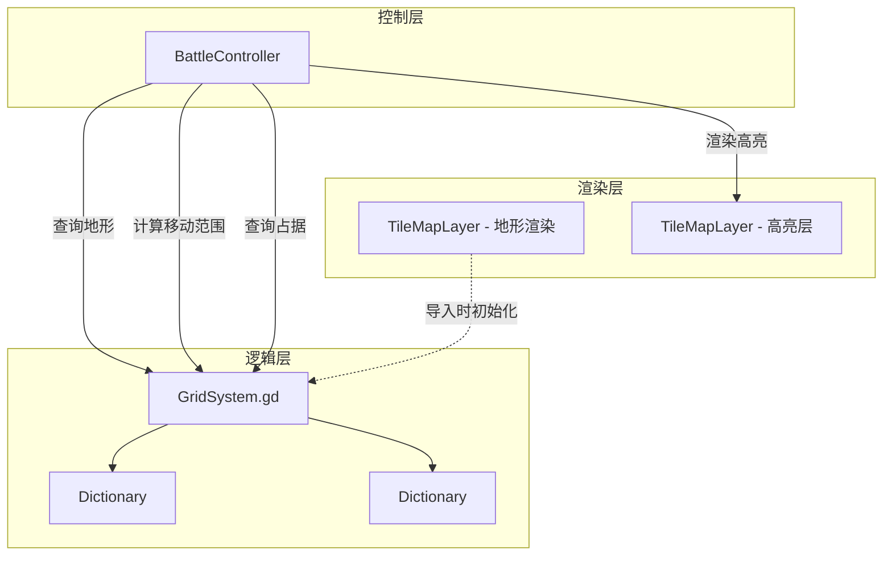
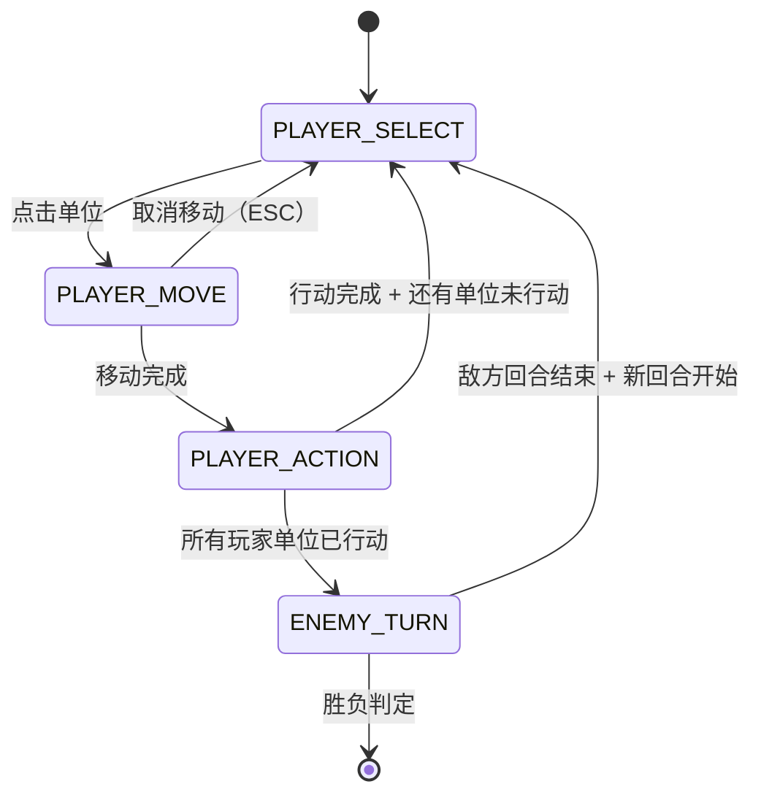

# BigWuXia — 技术栈选型文档

本文档详细说明 BigWuXia 的技术栈选型理由、网格系统实现方案（TileMapLayer vs AStar2D vs 纯 Node2D）、BFS/A* 算法思路、回合状态机、输入处理 FSM，以及 Godot 4.6 关键特性应用。

## 1. 核心技术栈总览

| 技术点 | 方案 | 版本 / 工具 |
|---|---|---|
| **游戏引擎** | Godot | 4.6.2（config_version=5） |
| **脚本语言** | GDScript | Godot 4.x 新语法（typed signals / Callable） |
| **网格渲染** | TileMapLayer | Godot 4.6 新 API（取代 TileMap 单类） |
| **网格逻辑** | 自建 GridSystem 脚本 | Dictionary[Vector2i → TileData] |
| **移动范围算法** | Dijkstra/BFS with cost | 自实现（地形消耗 ≠ 1） |
| **攻击范围算法** | Chebyshev 距离环形 | 自实现 |
| **寻路** | A* | 自实现（GridSystem 提供） |
| **回合管理** | 状态机（enum Phase） | TurnManager 单例 |
| **输入处理** | 鼠标主 + 键盘辅 | 子状态机（SELECT/MOVE/ACTION） |
| **动画** | AnimatedSprite2D | SpriteFrames 预设 |
| **粒子特效** | GPUParticles2D / CPUParticles2D | 2D 粒子系统 |
| **UI** | Control 节点 | CanvasLayer + Theme |
| **测试** | GUT（Godot Unit Test） | https://github.com/bitwes/Gut |
| **截图工具** | screenshot_harness.gd | extends SceneTree（参考 godot-dev skill） |

## 2. 网格系统选型（核心决策）

### 2.1 三种方案对比

BigWuXia 需要一个网格系统来管理：移动范围、攻击范围、单位占据、地形修正、寻路。Godot 提供多种方案：

| 方案 | 优点 | 缺点 | 适用场景 |
|---|---|---|---|
| **TileMap（4.5 及之前）** | 一体化（渲染+逻辑） | 4.6 已废弃（拆成 TileMapLayer） | 旧项目 |
| **TileMapLayer（4.6 新）** | 渲染高效，支持多层 | **只负责渲染，无逻辑能力** | 视觉地形 |
| **AStar2D（内置寻路）** | 内置 A* 算法 | **需要预先构建图**，动态 occupancy 支持差，不支持移动消耗 ≠ 1 | 静态地图寻路 |
| **纯 Node2D + Dictionary** | 最灵活，完全自定义 | 需要自己写 BFS/A*，渲染也要自己做 | 复杂逻辑游戏 |
| **TileMapLayer（渲染）+ GridSystem 脚本（逻辑）** | **渲染和逻辑分离**，各司其职 | 需要同步两套数据 | **SRPG / 战棋游戏（推荐）** |

### 2.2 BigWuXia 选型：TileMapLayer + GridSystem

**决策**: TileMapLayer（渲染）+ 自建 GridSystem 脚本（逻辑）

**理由**:
1. **TileMapLayer 专注渲染**：Godot 4.6 的 TileMapLayer 是纯渲染层，性能优秀，支持 autotile、多层叠加（地形 + overlay）
2. **逻辑网格独立管理**：移动范围/攻击范围/occupancy 是**动态数据**（每回合单位位置变化），不能依赖渲染层；自建 `GridSystem` 脚本用 `Dictionary[Vector2i → Tile]` 存储逻辑状态
3. **AStar2D 不适合 SRPG**：
   - AStar2D 需要预先构建图（`add_point` + `connect_points`），每次单位移动后要**重建整个图**（性能差）
   - AStar2D 不支持"移动消耗 ≠ 1"（林地消耗 2，路消耗 0.5），只能做等距网格
   - AStar2D 无法直接计算"移动范围"（只能找两点最短路径），需要遍历所有点做 `get_point_path` 暴力查询
4. **自建 BFS/A* 更灵活**：
   - BFS with movement cost 可以精确控制地形消耗
   - A* 可以自定义启发式函数（例如优先走路而非林地）
   - 移动范围计算只需一次 Dijkstra/BFS，时间复杂度 O(n)，n = 网格总数（12×10 = 120，非常小）

**结论**: TileMapLayer + GridSystem 是 SRPG 的最佳实践。

### 2.3 架构示意图



## 3. GridSystem 实现方案

### 3.1 核心数据结构

```gdscript
class_name GridSystem extends Node

var grid_size: Vector2i = Vector2i(12, 10)
var tiles: Dictionary = {}          # key: Vector2i(x, y), value: TileData
var occupancy: Dictionary = {}      # key: Vector2i(x, y), value: Unit（如果被占据）

func _ready() -> void:
    _init_tiles_from_tilemap()
```

### 3.2 初始化（从 TileMapLayer 读取）

```gdscript
func _init_tiles_from_tilemap() -> void:
    var tilemap := get_node("../TileMapLayer") as TileMapLayer
    for x in range(grid_size.x):
        for y in range(grid_size.y):
            var pos := Vector2i(x, y)
            var tile_id := tilemap.get_cell_tile_data(0, pos)  # Layer 0
            if tile_id:
                var custom_data := tile_id.get_custom_data("tile_id") as String
                var tile_data := GameBalance.get_tile_data(custom_data)
                tiles[pos] = tile_data
            else:
                tiles[pos] = GameBalance.get_tile_data("grass")  # 默认平地
```

### 3.3 关键方法接口

```gdscript
# 判断格子是否可通行
func is_walkable(pos: Vector2i) -> bool:
    if not is_valid_position(pos):
        return false
    var tile := tiles.get(pos)
    if tile == null or tile.is_obstacle:
        return false
    return not is_occupied(pos)

# 判断格子是否被单位占据
func is_occupied(pos: Vector2i) -> bool:
    return occupancy.has(pos)

# 获取地形数据
func get_tile(pos: Vector2i) -> TileData:
    return tiles.get(pos)

# 更新单位占据
func set_unit(pos: Vector2i, unit: Unit) -> void:
    occupancy[pos] = unit

func remove_unit(pos: Vector2i) -> void:
    occupancy.erase(pos)

# 计算移动范围（Dijkstra with movement cost）
func get_move_range(start: Vector2i, mov: int) -> Array[Vector2i]:
    # 见 §4.1

# 计算攻击范围（环形）
func get_attack_range(center: Vector2i, range_min: int, range_max: int) -> Array[Vector2i]:
    # 见 §4.2

# A* 寻路
func find_path(start: Vector2i, goal: Vector2i, mov: int) -> Array[Vector2i]:
    # 见 §4.3
```

## 4. 移动/攻击范围算法

### 4.1 移动范围（Dijkstra with movement cost）

**需求**: 从起点出发，计算移动力 `mov` 范围内所有可达格子。

**算法**: Dijkstra（优先队列）+ 地形移动消耗

**伪代码**:
```gdscript
func get_move_range(start: Vector2i, mov: int) -> Array[Vector2i]:
    var result: Array[Vector2i] = []
    var cost_map: Dictionary = { start: 0.0 }  # key: Vector2i, value: float（累积消耗）
    var queue: Array = [start]  # 简化用 Array，实际可用 PriorityQueue
    
    while not queue.is_empty():
        var current := queue.pop_front() as Vector2i
        var current_cost := cost_map[current]
        
        for neighbor in _get_neighbors(current):
            if not is_valid_position(neighbor):
                continue
            
            var tile := get_tile(neighbor)
            if tile.is_obstacle:
                continue
            
            var new_cost := current_cost + tile.movement_cost
            
            # 如果该格子被占据，可以"跨越"但不能停留
            if is_occupied(neighbor):
                if new_cost <= mov:
                    # 继续扩展（但不加入 result）
                    if not cost_map.has(neighbor) or new_cost < cost_map[neighbor]:
                        cost_map[neighbor] = new_cost
                        queue.append(neighbor)
                continue
            
            if new_cost > mov:
                continue
            
            if not cost_map.has(neighbor) or new_cost < cost_map[neighbor]:
                cost_map[neighbor] = new_cost
                result.append(neighbor)
                queue.append(neighbor)
    
    return result

func _get_neighbors(pos: Vector2i) -> Array[Vector2i]:
    return [
        pos + Vector2i(1, 0),   # 右
        pos + Vector2i(-1, 0),  # 左
        pos + Vector2i(0, 1),   # 下
        pos + Vector2i(0, -1),  # 上
    ]
```

**优化**（MVP 可选）:
- 用 `PriorityQueue`（堆）替代 `Array.pop_front()`，时间复杂度从 O(n²) 降到 O(n log n)
- Godot 4.x 无内置 PriorityQueue，可用 `Array.sort_custom` 或第三方库

### 4.2 攻击范围（Chebyshev 距离环形）

**需求**: 计算以 `center` 为中心，距离在 `[range_min, range_max]` 之间的所有格子。

**算法**: 遍历矩形区域 + 距离判定

**伪代码**:
```gdscript
func get_attack_range(center: Vector2i, range_min: int, range_max: int) -> Array[Vector2i]:
    var result: Array[Vector2i] = []
    
    for x in range(center.x - range_max, center.x + range_max + 1):
        for y in range(center.y - range_max, center.y + range_max + 1):
            var pos := Vector2i(x, y)
            if not is_valid_position(pos):
                continue
            
            var dist := _chebyshev_distance(center, pos)
            if dist >= range_min and dist <= range_max:
                result.append(pos)
    
    return result

func _chebyshev_distance(a: Vector2i, b: Vector2i) -> int:
    return max(abs(a.x - b.x), abs(a.y - b.y))
```

**备注**:
- **Chebyshev 距离**（棋盘距离）: max(|Δx|, |Δy|)，适合 8 方向移动的战棋
- **Manhattan 距离**（出租车距离）: |Δx| + |Δy|，适合 4 方向移动
- BigWuXia 用 Chebyshev 距离（因为近战 1 格包括斜向）

### 4.3 A* 寻路

**需求**: 找到从 `start` 到 `goal` 的最短路径（考虑地形消耗）。

**算法**: A* with movement cost

**伪代码**:
```gdscript
func find_path(start: Vector2i, goal: Vector2i, mov: int) -> Array[Vector2i]:
    var open_set: Array = [start]
    var came_from: Dictionary = {}
    var g_score: Dictionary = { start: 0.0 }
    var f_score: Dictionary = { start: _heuristic(start, goal) }
    
    while not open_set.is_empty():
        var current := _get_lowest_f_score(open_set, f_score)
        
        if current == goal:
            return _reconstruct_path(came_from, current)
        
        open_set.erase(current)
        
        for neighbor in _get_neighbors(current):
            if not is_valid_position(neighbor):
                continue
            
            var tile := get_tile(neighbor)
            if tile.is_obstacle or is_occupied(neighbor):
                continue
            
            var tentative_g := g_score[current] + tile.movement_cost
            
            if tentative_g > mov:  # 超出移动力
                continue
            
            if not g_score.has(neighbor) or tentative_g < g_score[neighbor]:
                came_from[neighbor] = current
                g_score[neighbor] = tentative_g
                f_score[neighbor] = tentative_g + _heuristic(neighbor, goal)
                if neighbor not in open_set:
                    open_set.append(neighbor)
    
    return []  # 无路径

func _heuristic(a: Vector2i, b: Vector2i) -> float:
    return _chebyshev_distance(a, b) as float

func _get_lowest_f_score(open_set: Array, f_score: Dictionary) -> Vector2i:
    var lowest := open_set[0]
    for node in open_set:
        if f_score.get(node, INF) < f_score.get(lowest, INF):
            lowest = node
    return lowest

func _reconstruct_path(came_from: Dictionary, current: Vector2i) -> Array[Vector2i]:
    var path: Array[Vector2i] = [current]
    while came_from.has(current):
        current = came_from[current]
        path.push_front(current)
    return path
```

**优化**（MVP 可选）:
- 用 PriorityQueue 存储 `open_set`，提升 `_get_lowest_f_score` 性能

## 5. 回合状态机（TurnManager）

### 5.1 状态定义

```gdscript
enum Phase {
    PLAYER_SELECT,      # 玩家选择单位
    PLAYER_MOVE,        # 玩家移动单位
    PLAYER_ACTION,      # 玩家选择行动（攻击/技能/待机）
    ENEMY_TURN,         # 敌方回合（AI 自动）
}
```

### 5.2 状态转换图



### 5.3 TurnManager 实现骨架

```gdscript
class_name TurnManager extends Node

var current_phase: Phase = Phase.PLAYER_SELECT
var current_turn: int = 1
var player_units: Array[Unit] = []
var enemy_units: Array[Unit] = []
var current_unit: Unit = null

signal turn_started(turn_num: int)
signal phase_changed(phase: Phase)
signal unit_action_ready(unit: Unit)

func start_battle() -> void:
    _reset_all_units()
    current_turn = 1
    turn_started.emit(current_turn)
    _start_player_phase()

func _start_player_phase() -> void:
    current_phase = Phase.PLAYER_SELECT
    phase_changed.emit(current_phase)

func select_unit(unit: Unit) -> void:
    if current_phase != Phase.PLAYER_SELECT:
        return
    if unit.acted:
        return
    current_unit = unit
    current_phase = Phase.PLAYER_MOVE
    phase_changed.emit(current_phase)
    unit_action_ready.emit(unit)

func complete_move() -> void:
    current_phase = Phase.PLAYER_ACTION
    phase_changed.emit(current_phase)

func complete_action() -> void:
    current_unit.acted = true
    current_unit = null
    
    if _all_player_units_acted():
        _start_enemy_phase()
    else:
        current_phase = Phase.PLAYER_SELECT
        phase_changed.emit(current_phase)

func _start_enemy_phase() -> void:
    current_phase = Phase.ENEMY_TURN
    phase_changed.emit(current_phase)
    _execute_enemy_ai()

func _execute_enemy_ai() -> void:
    for enemy in enemy_units:
        if enemy.hp <= 0:
            continue
        await _ai_act(enemy)  # AI 行动（见 §6）
    
    _next_turn()

func _next_turn() -> void:
    current_turn += 1
    _reset_all_units()
    turn_started.emit(current_turn)
    _start_player_phase()

func _reset_all_units() -> void:
    for unit in player_units + enemy_units:
        unit.acted = false

func _all_player_units_acted() -> bool:
    return player_units.all(func(u): return u.acted or u.hp <= 0)
```

## 6. 敌方 AI 实现

### 6.1 简单贪心 AI

```gdscript
# ai_controller.gd
class_name AIController

static func act(unit: Unit, grid: GridSystem, targets: Array[Unit]) -> void:
    var target := _find_nearest_target(unit, targets, grid)
    if target == null:
        return  # 无目标，待机
    
    # 如果在攻击范围内，直接攻击
    if _is_in_attack_range(unit, target, grid):
        unit.attack(target)
        return
    
    # 否则，向目标移动
    var path := grid.find_path(unit.current_position, target.current_position, unit.unit_data.mov)
    if path.size() > 1:
        var move_target := path[min(path.size() - 1, unit.unit_data.mov)]
        unit.move_to(move_target)
        await unit.move_finished
        
        # 移动后再判断是否在攻击范围
        if _is_in_attack_range(unit, target, grid):
            unit.attack(target)
        else:
            # 待机（移动后不够攻击）
            pass

static func _find_nearest_target(unit: Unit, targets: Array[Unit], grid: GridSystem) -> Unit:
    var nearest: Unit = null
    var min_dist := INF
    for target in targets:
        if target.hp <= 0:
            continue
        var dist := grid._chebyshev_distance(unit.current_position, target.current_position)
        if dist < min_dist:
            min_dist = dist
            nearest = target
    return nearest

static func _is_in_attack_range(unit: Unit, target: Unit, grid: GridSystem) -> bool:
    var dist := grid._chebyshev_distance(unit.current_position, target.current_position)
    return dist <= unit.unit_data.weapon_range
```

## 7. 输入处理（FSM）

### 7.1 输入模式

BigWuXia 支持两种输入：
- **鼠标主**：点击单位 → 点击移动目标 → 点击行动按钮 → 点击攻击目标
- **键盘辅**：WASD 移动光标 + Enter 确认 + ESC 取消

### 7.2 鼠标输入流程

```gdscript
# battle_controller.gd
func _input(event: InputEvent) -> void:
    if event is InputEventMouseButton and event.pressed:
        var mouse_pos := get_global_mouse_position()
        var grid_pos := _screen_to_grid(mouse_pos)
        
        match turn_manager.current_phase:
            TurnManager.Phase.PLAYER_SELECT:
                _handle_select_input(grid_pos)
            TurnManager.Phase.PLAYER_MOVE:
                _handle_move_input(grid_pos)
            TurnManager.Phase.PLAYER_ACTION:
                _handle_action_input(grid_pos)

func _handle_select_input(grid_pos: Vector2i) -> void:
    var unit := grid_system.occupancy.get(grid_pos)
    if unit and unit in turn_manager.player_units and not unit.acted:
        turn_manager.select_unit(unit)
        _show_move_range(unit)

func _handle_move_input(grid_pos: Vector2i) -> void:
    if grid_pos in _current_move_range:
        turn_manager.current_unit.move_to(grid_pos)
        await turn_manager.current_unit.move_finished
        turn_manager.complete_move()
        _show_action_panel()

func _handle_action_input(grid_pos: Vector2i) -> void:
    # 点击攻击目标
    if _current_action == "attack" and grid_pos in _current_attack_range:
        var target := grid_system.occupancy.get(grid_pos)
        if target:
            turn_manager.current_unit.attack(target)
            turn_manager.complete_action()
```

### 7.3 键盘输入（MVP 可选）

```gdscript
# 用 WASD 移动光标
func _process(delta: float) -> void:
    if Input.is_action_just_pressed("ui_up"):
        _cursor_pos.y -= 1
    if Input.is_action_just_pressed("ui_down"):
        _cursor_pos.y += 1
    if Input.is_action_just_pressed("ui_left"):
        _cursor_pos.x -= 1
    if Input.is_action_just_pressed("ui_right"):
        _cursor_pos.x += 1
    
    _cursor_pos = _clamp_to_grid(_cursor_pos)
    _update_cursor_sprite()
```

## 8. Godot 4.6 关键特性应用

### 8.1 TileMapLayer（新 API）

**变化**: Godot 4.6 拆分 `TileMap` 为多个 `TileMapLayer` 节点

**用法**:
```gdscript
# 旧版 TileMap（4.5）
var tilemap := get_node("TileMap")
tilemap.set_cell(0, Vector2i(5, 5), 1, Vector2i(0, 0))  # Layer 0, pos, source_id, atlas_coords

# 新版 TileMapLayer（4.6）
var layer0 := get_node("TileMapLayer")  # 单层
layer0.set_cell(Vector2i(5, 5), 0, Vector2i(0, 0))  # pos, source_id, atlas_coords
```

**好处**: 多层地图用多个 TileMapLayer 节点，性能更好（独立渲染）

### 8.2 Unique Node IDs

**启用**: `Project > Tools > Upgrade Project Files`

**用法**:
```gdscript
# 旧版（路径引用）
@onready var health_bar := $"UI/HealthBar"

# 新版（Unique Name，% 语法）
@onready var health_bar: ProgressBar = %HealthBar  # 无论节点在哪，都能找到
```

**好处**: 节点重命名/移动不断引用

### 8.3 UID 资源引用

**用法**: Ctrl+drag 资源到 Inspector，自动用 UID 而非路径

**好处**: 文件重命名/移动不断链

## 9. 性能优化（MVP 可选，后续版本）

| 优化点 | 方案 | 收益 |
|---|---|---|
| BFS/A* 用 PriorityQueue | 用堆替代 Array.sort() | O(n log n) vs O(n²) |
| 移动范围缓存 | 相同 mov 的单位共用结果 | 减少重复计算 |
| TileMapLayer 多层合并 | 地形 + 装饰 + overlay 三层分离 | 减少重绘 |
| AnimatedSprite2D 批处理 | 用 SpriteFrames 预设，避免运行时创建 | 减少 GC |
| 粒子特效池化 | GPUParticles2D 复用 | 减少实例化开销 |

## 10. 测试策略

### 10.1 单元测试（GUT）

```gdscript
# tests/test_grid_system.gd
extends GutTest

func test_get_move_range():
    var grid := GridSystem.new()
    grid.grid_size = Vector2i(5, 5)
    # 假设全是平地（cost=1）
    for x in range(5):
        for y in range(5):
            grid.tiles[Vector2i(x, y)] = TileData.new()
            grid.tiles[Vector2i(x, y)].movement_cost = 1.0
    
    var start := Vector2i(2, 2)
    var mov := 2
    var range := grid.get_move_range(start, mov)
    
    # 应该包含 (2,2) 周围 2 格内的所有格子
    assert_has(range, Vector2i(2, 0))
    assert_has(range, Vector2i(0, 2))
    assert_has(range, Vector2i(4, 2))
    assert_has(range, Vector2i(2, 4))
    assert_eq(range.size(), 13)  # 1 + 4×1 + 4×2（菱形）
```

### 10.2 E2E 测试（screenshot_harness + 输入注入）

```gdscript
# tests/e2e/test_battle_input.gd
extends SceneTree

func _init() -> void:
    _run.call_deferred()

func _run() -> void:
    var battle_scene := load("res://scenes/battle/battle.tscn").instantiate()
    root.add_child(battle_scene)
    
    await process_frame
    await process_frame
    
    # 模拟点击单位
    var click_event := InputEventMouseButton.new()
    click_event.button_index = MOUSE_BUTTON_LEFT
    click_event.pressed = true
    click_event.position = Vector2(320, 320)  # 假设单位在 (5, 5)
    Input.parse_input_event(click_event)
    
    await process_frame
    
    # 检查状态
    var controller := battle_scene.get_node("BattleController")
    assert(controller.turn_manager.current_phase == TurnManager.Phase.PLAYER_MOVE)
    
    quit(0)
```

---

**下一步**：阅读 [05-mvp-scope.md](./05-mvp-scope.md) 了解 MVP 详细范围和 2 关卡设计。
